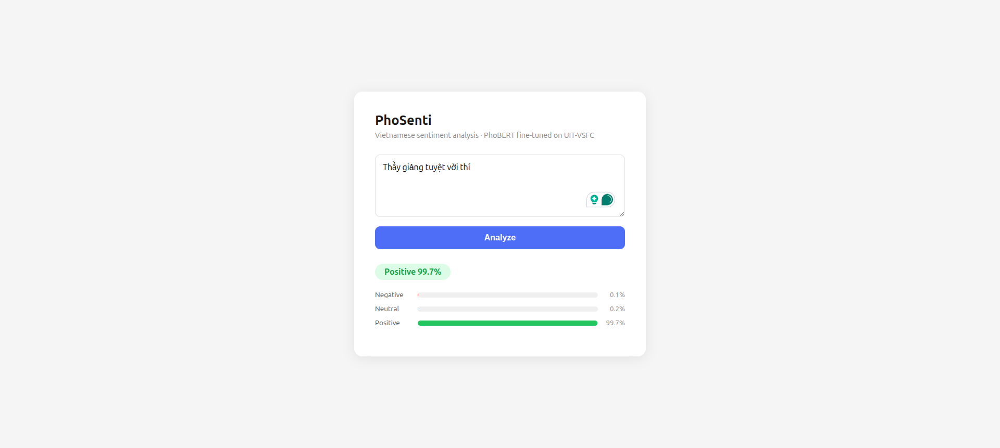
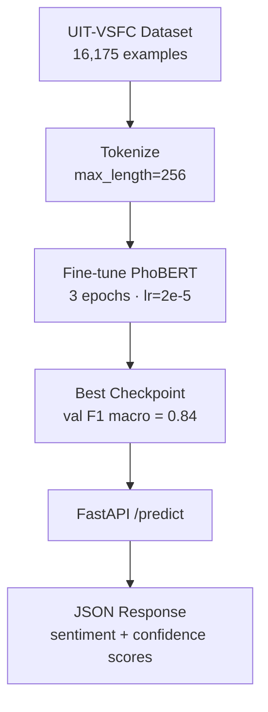

# PhoSenti — Vietnamese Sentiment Analysis

Fine-tuned [PhoBERT](https://github.com/VinAIResearch/PhoBERT) for 3-class sentiment classification on Vietnamese student feedback.



## Results

| Metric | Score |
|---|---|
| Accuracy | 93.3% |
| F1 Macro | 0.84 |
| F1 Negative | 0.95 |
| F1 Neutral | 0.57 |
| F1 Positive | 0.95 |

Evaluated on the [UIT-VSFC](https://huggingface.co/datasets/ura-hcmut/UIT-VSFC) test set (3,166 examples).

## Architecture

```mermaid
flowchart LR
    A[Vietnamese Text] --> B[PhoBERT Tokenizer]
    B --> C[Input IDs + Attention Mask]
    C --> D[PhoBERT-base\n12 Transformer Layers]
    D --> E[[CLS] Vector\n768 dims]
    E --> F[Classification Head\nDense → ReLU → Dense]
    F --> G[Logits\n3 classes]
    G --> H[Softmax]
    H --> I{Sentiment}
    I --> J[Negative]
    I --> K[Neutral]
    I --> L[Positive]
```

## Pipeline



## Setup

```bash
pip install transformers datasets torch scikit-learn fastapi uvicorn accelerate
```

## Run the API

```bash
python app.py
# → http://localhost:8000
```

## API Usage

```bash
curl -X POST http://localhost:8000/predict \
  -H "Content-Type: application/json" \
  -d '{"text": "Thầy giảng rất dễ hiểu và nhiệt tình hỗ trợ sinh viên."}'
```

```json
{
  "text": "Thầy giảng rất dễ hiểu và nhiệt tình hỗ trợ sinh viên.",
  "sentiment": "positive",
  "confidence": 0.97,
  "scores": {
    "negative": 0.01,
    "neutral": 0.02,
    "positive": 0.97
  }
}
```

## Training

See `notebook.ipynb` for the full pipeline:
- Dataset: UIT-VSFC (11,426 train / 1,584 val / 3,166 test)
- Base model: `vinai/phobert-base`
- Fine-tuning: 3 epochs, AdamW, lr=2e-5
- Best checkpoint selected by validation F1 macro

## Stack

- PyTorch + HuggingFace Transformers
- PhoBERT (Vietnamese BERT pre-trained by VinAI)
- UIT-VSFC dataset (Vietnamese student feedback corpus)
- FastAPI
